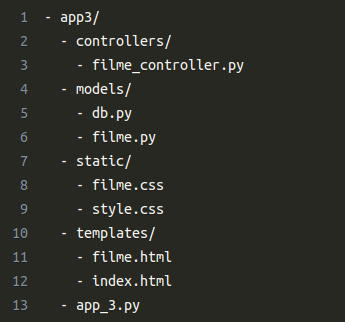
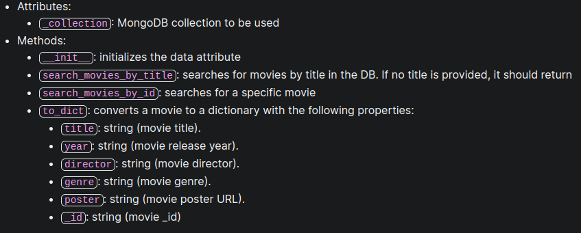
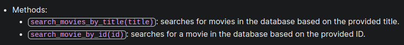
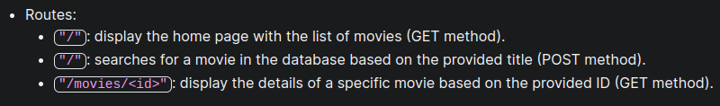

# Flask Exercises

## Exercise 1

Create a students registration system using Flask, Jina2 and MVC architecture; (CRUD; app1/app_1.py) 

#### Requisites:
<ul>
    <li><b>01. </b>Create a route to show (R - READ) the registered students list. The list must contain "name" and "enrollment" of each student. The list must be on the "students.html" file</li>
    <li><b>02. </b>Create a route to create (C - CREATE) a new student in the system. A form must be used to request the student's "name" and "enrollment" in the "create_student.html" file</li>
    <li><b>03. </b>Create a route to edit (U - UPDATE) existing info. A form must be used to update the current student's data, showing them (current data) on the initial state of the form in the "update_student.html" file. Submiting form info should update the current student info and navigate to the students list page.</li>
    <li><b>04. </b>Create a route to delete (D - DELETE) a student from the system. Deleting the student must update the students list and navigate to the students list page.</li>
    <li><b>05. </b>Create a "style.css" file to style the HTML pages using CSS.</li>
</ul>

---

## Exercise 2

Recreate the code from Exercise 1 to use MongoDB instead of an array; (CRUD; app2/app_2.py)

#### Requisite:
<ul>
    <li><b>01. </b>Create a "models" folder and a "db.py" file with the database connection.</li>
    <li><b>02. </b>Create a "student_model.py" file, a "StudentModel" class and implement the CRUD functions inside it.</li>
    <li><b>03. </b>Make the necessary changes to the "app.py" file and/or HTML files.</li>
</ul>

---

## Exercise 3

Create a movie catalog using Flask, Jinja2 and MongoDB; (app3/app_3.py)

#### Requisite:
<ul>
    <li><b>01. </b>Create and organize the folders structure like the image below. </li>
    <li><b>02. </b>In "models/film.py", define the "Film" class with these attributes and methods: </li>
    <li><b>03. </b>Create the database connection on the "models/db.py" file.</li>
    <li><b>04. </b>In "controllers/film_controller.py", define the "FilmController" class with these methods: </li>
    <li><b>05. </b>Create "app_3.py" file, import the necessary Flask modules, models and controllers, then define these routes: </li>
    <li><b>06. </b>Create the HTML templates in "templates" folder.</li>
</ul>
